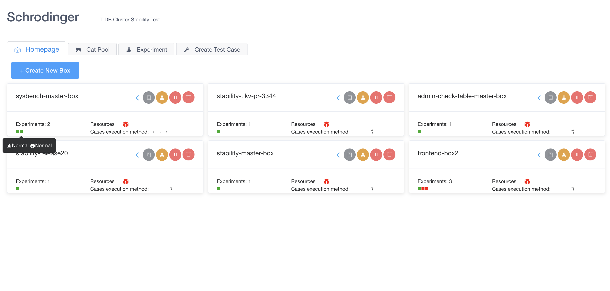
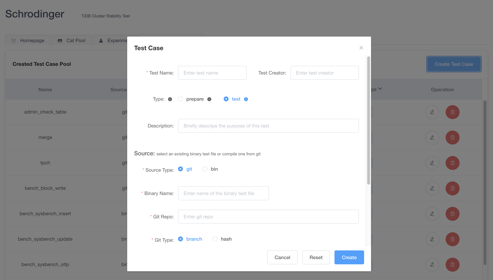
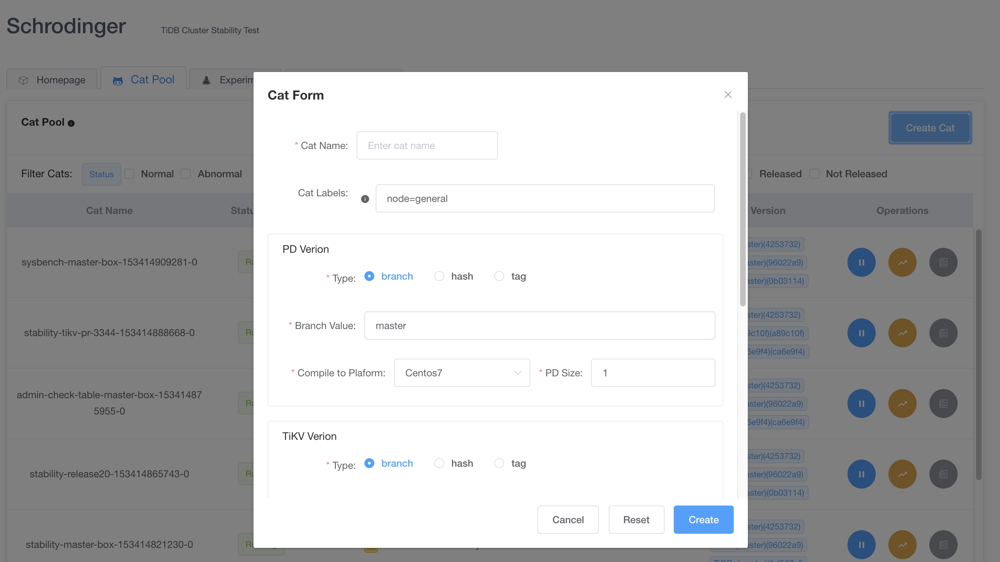
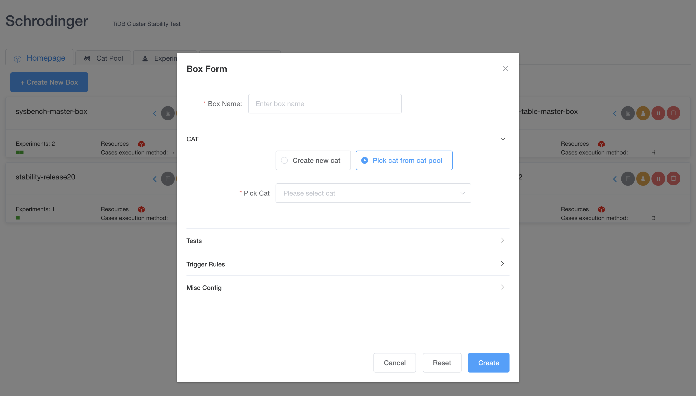
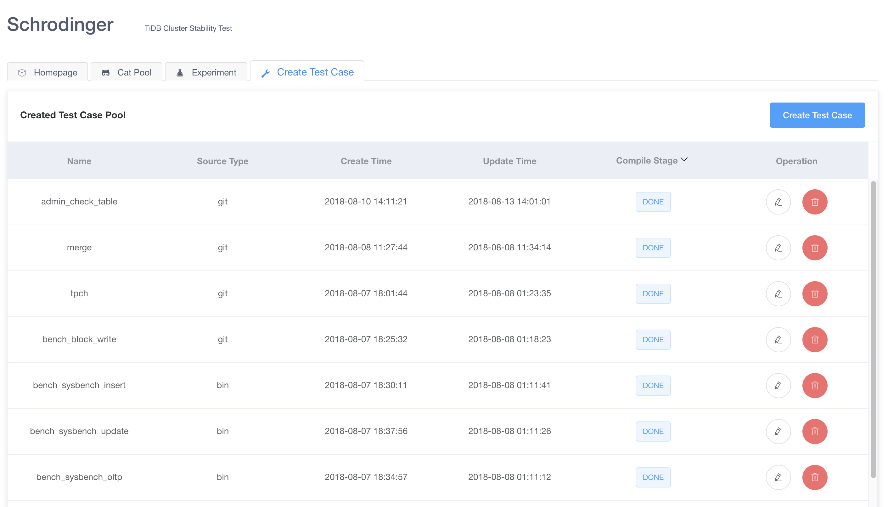
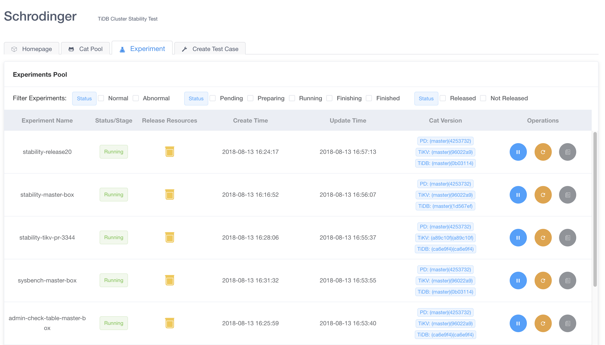
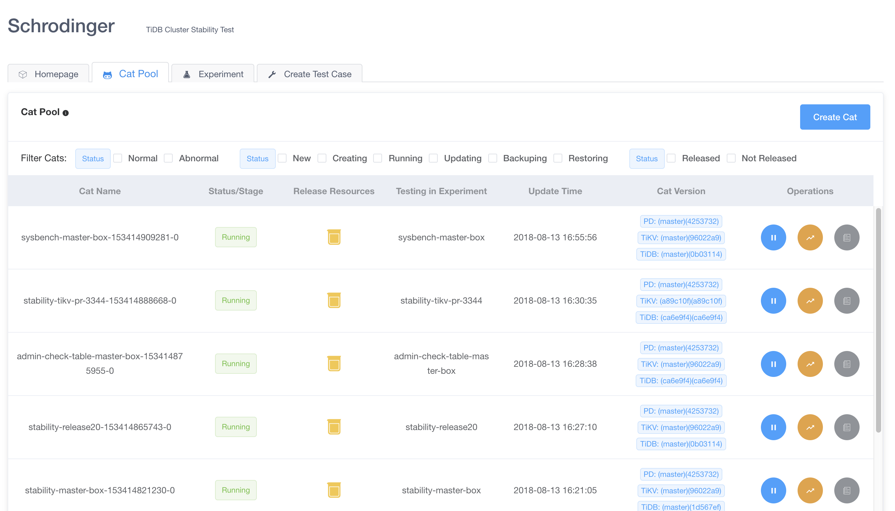

# Example: Schrödinger

At PingCAP we have a system called Schrödinger which we use for our Chaos Testing. 

It has a web UI for configuration, here you can see our dashboard of current tests:

Here you can see the interface for creating the cases:

We refer to particular checkouts to be tested as 'cats':

Managing resources and cases:

